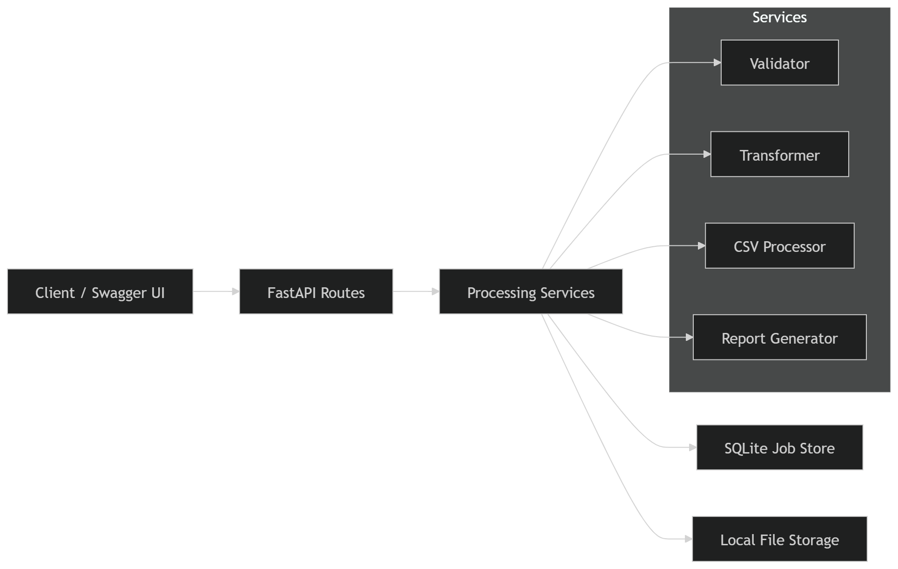
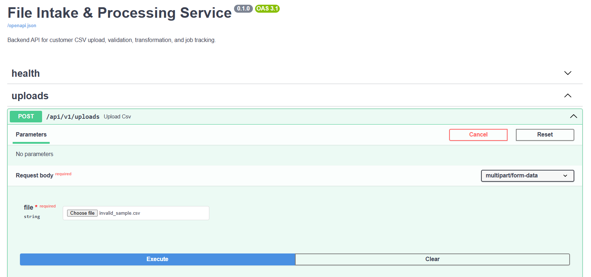
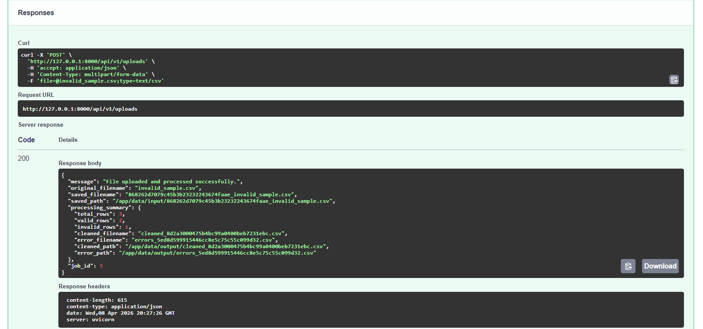

# File Intake & Processing Service

FastAPI backend for customer CSV intake, validation, normalization, job tracking, and downloadable processing outputs.

## Overview

This project simulates an internal business data intake service. A user uploads a structured customer CSV file, the backend validates each row against business rules, normalizes valid records, generates a cleaned output file and an error report, stores processing job history in SQLite, and exposes endpoints to retrieve and download the results.

I built this project to demonstrate practical backend engineering skills in a compact, portfolio-friendly format:
- REST API design
- file upload handling
- schema-based validation
- deterministic transformation logic
- artifact generation
- persistence
- structured logging
- automated testing
- Docker
- CI with GitHub Actions

## Features

- Upload customer CSV files
- Validate rows against a defined business schema
- Normalize valid records
- Generate cleaned CSV output
- Generate error report CSV for invalid rows
- Persist processing jobs in SQLite
- List processing jobs
- Retrieve processing job details
- Download cleaned and error output files
- OpenAPI / Swagger documentation
- Structured JSON-style logging
- Dockerized local setup
- Automated tests with pytest
- GitHub Actions CI

## Architecture

The service is organized into a few simple layers:

- **API layer**: upload, jobs, and health endpoints
- **Service layer**: validation, transformation, CSV processing, and report generation
- **Persistence layer**: SQLite + SQLModel for job history
- **Storage layer**: local filesystem for uploaded and generated files
- **Core layer**: config, DB initialization, and logging



## API Endpoints

- `GET /health`
- `POST /api/v1/uploads`
- `GET /api/v1/jobs`
- `GET /api/v1/jobs/{job_id}`
- `GET /api/v1/jobs/{job_id}/download/clean`
- `GET /api/v1/jobs/{job_id}/download/errors`

Swagger UI is available at:

- `http://127.0.0.1:8000/docs`

## CSV Schema

Expected CSV columns:

- `customer_id`
- `email`
- `country`
- `signup_date`
- `order_amount`

### Validation rules

- `customer_id` is required
- `email` must be a valid email address
- `country` must be one of `DE, FR, IN, US, GB`
- `signup_date` must be in `YYYY-MM-DD` format
- `order_amount` must be numeric and non-negative

### Transformation rules

For valid rows:
- `customer_id` is uppercased
- `email` is lowercased
- `country` is uppercased
- `signup_date` is normalized to `YYYY-MM-DD`
- `order_amount` is formatted to 2 decimals

## Example Workflow

1. Upload a CSV file
2. The backend validates and processes the file
3. Valid rows are written to a cleaned CSV file
4. Invalid rows are written to an error report CSV file
5. A processing job is stored in SQLite
6. The client can list jobs, inspect a job, and download output files

## Sample Files

Example files are included in the `samples/` folder:

- `samples/sample.csv`
- `samples/invalid_sample.csv`

## Running Locally

```bash
python3 -m venv .venv
source .venv/bin/activate
pip install -r requirements.txt
uvicorn app.main:app --reload
```

## Running Tests
```bash
pytest
```

## Running with Docker
```bash
docker compose up --build
```

## CI
This project uses GitHub Actions to run automated tests on push and pull request.

## Screenshots

### Upload endpoint


### Upload response


## Future Improvements
1. Support multiple CSV processing profiles
2. Background job processing for larger files
3. PostgreSQL instead of SQLite
4. Cloud file storage integration
5. Authentication and authorization
6. Metrics and monitoring