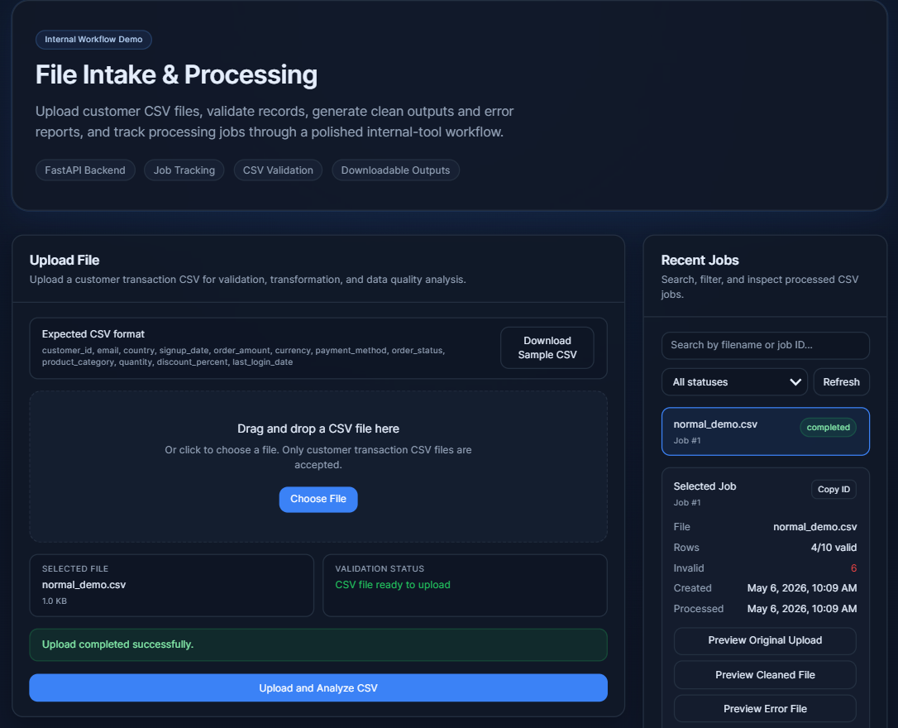
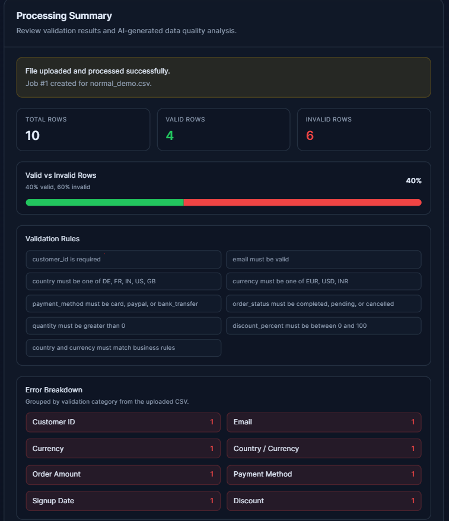
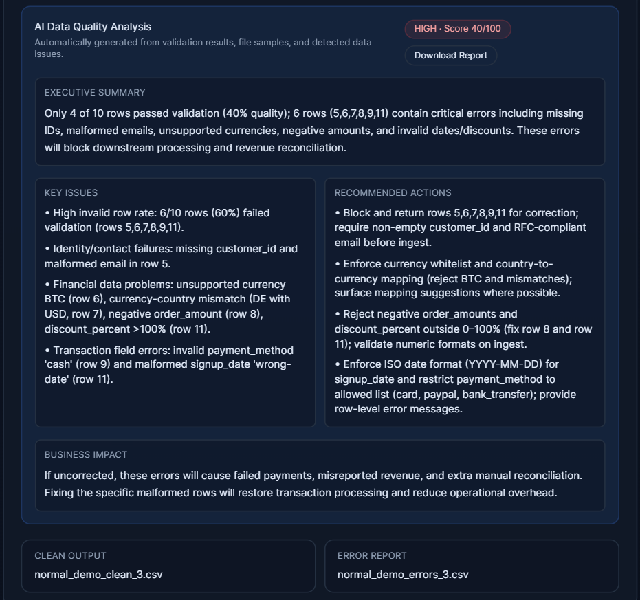
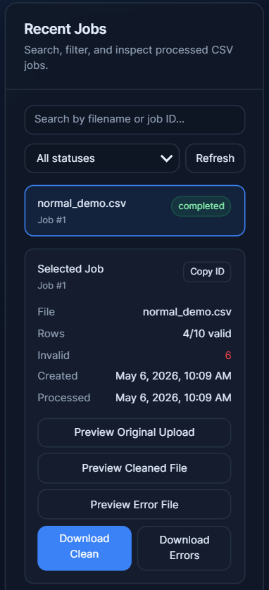
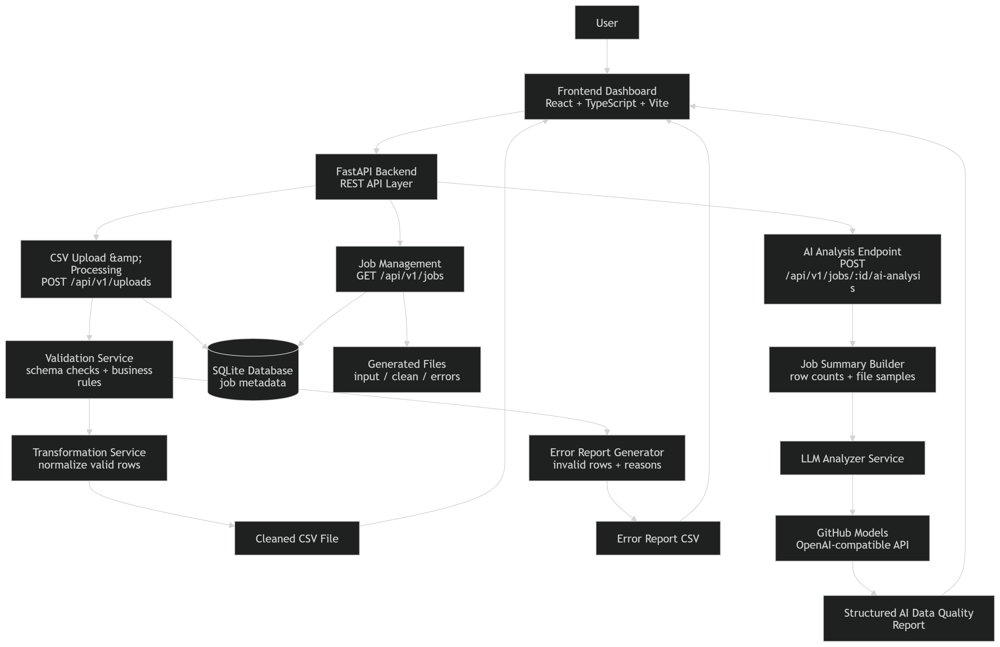

# File Intake & Processing Service

A full-stack internal-tool style application for uploading customer CSV files, validating and transforming the data, generating cleaned output and error reports, tracking processing jobs, previewing uploaded/generated files, and producing AI-assisted data quality analysis.

This project started as a backend-focused CSV processing service and evolved into a polished full-stack product with a modern frontend, job tracking, file previews, and LLM-based analysis to make the workflow more realistic and portfolio-worthy.

---

## Live Demo

- **Frontend:** https://file-intake-processing-service.vercel.app/
- **Backend API:** https://file-intake-processing-service.onrender.com
- **API Docs:** https://file-intake-processing-service.onrender.com/docs

> **Note:** The backend is hosted on Render's free tier, so the first request may take some time while the service wakes up. The AI analysis also depends on GitHub Models and can take a few seconds to generate.

---

## Project Overview

Many real internal tools are not flashy consumer products. They solve operational problems clearly and reliably.

This project simulates a real business workflow where teams upload CSV files, validate business data, generate corrected outputs, inspect rejected rows, and review structured AI-generated analysis of data quality issues.

Imagine an operations team receiving CSV exports from different sources and wanting to:

- Catch broken rows before ingestion
- Standardize values
- Produce a clean file for downstream use
- Inspect invalid rows separately
- Understand the quality issues in business terms

This tool simulates exactly that kind of workflow. The goal was to build something that feels like a believable internal product, not just a toy upload form.

The application supports:

- CSV upload from a modern frontend
- Validation and transformation pipeline
- Cleaned output and error file generation
- Processing summary metrics
- Recent jobs panel with search/filter
- File preview support
- AI-assisted data quality analysis using GitHub Models / OpenAI-compatible API

---

## Screenshots

_Add 2–3 screenshots here after deployment._

### Dashboard


### Processing Summary


### AI Data Quality Analysis


### Job History and File Preview


---

## Key Features

### CSV Processing
- Upload customer/order CSV files
- Validate required schema and business rules
- Transform valid rows into normalized output
- Split valid and invalid rows into separate output files

### Job Tracking
- Store processing jobs in a SQLite database
- Track uploaded file name, generated files, status, timestamps, and row counts
- View recent jobs in the frontend
- Search/filter jobs from the jobs panel

### File Outputs
- Preview uploaded input file
- Preview cleaned output file
- Preview error report file
- Download generated cleaned and error CSVs

### Processing Summary
- Total rows
- Valid rows
- Invalid rows
- Progress-style valid vs invalid indicator

### AI Data Quality Analysis
- Generate structured AI analysis after upload
- Summarize major issues in plain language
- Highlight likely root causes
- Provide business impact and recommended actions

> **Performance note:** AI analysis is generated through GitHub Models, so response time can vary depending on model availability and request latency. The app keeps the analysis structured and concise to reduce unnecessary delay.

### UX
- Drag-and-drop upload zone
- CSV-only frontend validation
- Selected file name and file size display
- Auto-scroll to results after upload
- Responsive internal-tool dashboard layout
- Dark-friendly design with hero, upload, results, and jobs panels

---

## Architecture



### End-to-End Workflow

1. User uploads a CSV file from the frontend
2. Frontend validates that the file is a `.csv`
3. Backend stores the uploaded file
4. Backend validates the CSV structure and row values
5. Valid rows are transformed and written to a cleaned CSV
6. Invalid rows are written to an error report CSV
7. Job metadata is stored in SQLite
8. Frontend displays:
   - Processing summary
   - Previews of uploaded / cleaned / error files
   - AI data quality analysis
9. The job appears in the recent jobs panel for later review

---

## Tech Stack

### Frontend
- React
- TypeScript
- Vite
- Tailwind CSS
- pnpm

### Backend
- FastAPI
- SQLModel
- SQLite
- pytest
- Structured logging

### AI / Analysis
- GitHub Models via OpenAI-compatible API
- OpenAI Python client

### Tooling / Infra
- Docker
- GitHub Actions CI
- Swagger / OpenAPI
- Render (backend hosting)
- Vercel (frontend hosting)

---

## Project Structure

```
.
├── backend/
│   ├── app/
│   │   ├── api/
│   │   │   └── routes/
│   │   ├── core/
│   │   ├── models/
│   │   ├── schemas/
│   │   ├── services/
│   │   └── utils/
│   ├── data/
│   │   ├── input/
│   │   └── output/
│   ├── tests/
│   ├── requirements.txt
│   └── pytest.ini
│
├── frontend/
│   ├── src/
│   │   ├── components/
│   │   │   ├── layout/
│   │   │   └── panels/
│   │   ├── lib/
│   │   ├── App.tsx
│   │   └── main.tsx
│   ├── package.json
│   └── vite.config.ts
│
├── .github/
│   └── workflows/
│
├── docker-compose.yml
└── README.md
```

---

## CSV Schema & Validation

### Schema

The current version uses an expanded business-style schema:

| Field | Description |
|---|---|
| `customer_id` | Unique customer identifier |
| `email` | Customer email address |
| `country` | Customer country |
| `signup_date` | Date of account signup |
| `order_amount` | Order total amount |
| `currency` | Order currency |
| `payment_method` | Method of payment |
| `order_status` | Current order status |
| `product_category` | Product category |
| `quantity` | Quantity ordered |
| `discount_percent` | Discount applied (%) |
| `last_login_date` | Date of last login |

### Validation Rules

- `customer_id` is required
- `email` must be valid
- `country` must be one of the allowed values
- `signup_date` must follow `YYYY-MM-DD`
- `order_amount` must be numeric and non-negative
- `currency` must be valid
- `payment_method` must be in the allowed set
- `discount_percent` must be within the accepted range
- `quantity` must be numeric / positive where applicable
- Header validation checks required columns before row processing

The backend also generates error categories and row-level error messages for invalid rows.

### Transformation Rules

Applied only to valid rows before writing the cleaned output CSV:

- `customer_id` normalized to uppercase
- `email` normalized to lowercase
- `country` normalized to uppercase
- Dates normalized to standard format
- Monetary / numeric fields formatted consistently

### Generated Outputs

After processing, the backend generates:

**1. Cleaned CSV** — Valid rows after transformation.

**2. Error Report CSV** — Invalid rows with row-level validation errors.

**3. Job Metadata** — Saved in SQLite and exposed through the jobs API.

---

## AI Data Quality Analysis

The app generates AI-assisted analysis for uploaded files using GitHub Models through an OpenAI-compatible API.

The analysis is designed to be more useful than raw validation messages. It converts row-level issues into structured insights:

- Executive summary
- Major data quality problems
- Likely root causes
- Recommended actions
- Business impact

This adds an explainability layer on top of deterministic validation, making the tool stronger from a product perspective.

> **Note:** AI analysis requires environment variables to be configured locally or in deployment.

---

## API Endpoints

### Health
```
GET /health
```

### Uploads
```
POST /api/v1/uploads
```

### Jobs
```
GET  /api/v1/jobs
GET  /api/v1/jobs/{job_id}
GET  /api/v1/jobs/{job_id}/download/input
GET  /api/v1/jobs/{job_id}/download/clean
GET  /api/v1/jobs/{job_id}/download/errors
POST /api/v1/jobs/{job_id}/ai-analysis
```

---

## Local Development Setup

### 1. Clone the repository

```bash
git clone https://github.com/iayushmahajan/File-Intake-Processing-Service.git
cd File-Intake-Processing-Service
```

### 2. Backend setup

```bash
cd backend
python -m venv .venv
source .venv/bin/activate
pip install -r requirements.txt
```

Create a `.env` file inside `backend/`:

```env
OPENAI_API_KEY=your_github_models_token
OPENAI_BASE_URL=https://models.inference.ai.azure.com
OPENAI_MODEL=gpt-5-mini
```

Run the backend:

```bash
uvicorn app.main:app --reload
```

- Backend runs on: `http://127.0.0.1:8000`
- Swagger docs: `http://127.0.0.1:8000/docs`

### 3. Frontend setup

In a new terminal:

```bash
cd frontend
pnpm install
pnpm dev
```

- Frontend runs on: `http://127.0.0.1:5173`

If needed, create a frontend `.env` file:

```env
VITE_API_BASE_URL=http://127.0.0.1:8000
```

---

## Running Tests

### Backend tests

```bash
cd backend
pytest
```

### Frontend build check

```bash
cd frontend
pnpm build
```

### CI

GitHub Actions is configured to install backend dependencies, run backend tests, and build the frontend — keeping the project stable as features evolve.

---

## Deployment

### Setup
- **Frontend:** Vercel
- **Backend:** Render

### Backend environment variables

Set these in Render:

```env
OPENAI_API_KEY=your_github_models_token
OPENAI_BASE_URL=https://models.inference.ai.azure.com
OPENAI_MODEL=gpt-5-mini
```

### Frontend environment variable

Set this in Vercel:

```env
VITE_API_BASE_URL=https://your-render-backend-url.onrender.com
```

### Hosting Notes

The frontend is deployed on Vercel and the backend is deployed on Render.

Since the backend currently uses local SQLite and generated CSV files on the backend filesystem, this deployment is intended as a portfolio/demo deployment rather than a production setup. On Render's free tier, the backend may sleep after inactivity, so the first API request can be slow.

For a production version, generated files should be moved to cloud object storage and job metadata should be stored in a managed database such as PostgreSQL.

---

## Design Decisions

### Kept architecture simple
No Redux, no React Query, no heavy chart libraries. The goal was a clean, explainable solution.

### SQLite kept for practicality
Good enough for a portfolio/internal-tool style application.

### CSV files generated on backend
Makes the workflow realistic and easy to reason about.

### AI analysis added on top of deterministic validation
Validation remains rule-based and reliable, while the LLM adds interpretive value.

---

## Challenges Solved

Some practical engineering issues addressed during development:

- Moved backend into its own `backend/` directory
- Switched frontend package manager from npm to pnpm due to WSL install issues
- Resolved CI workflow issues
- Handled ignored generated files properly
- Fixed test isolation and SQLite table setup for CI
- Added `.env`-based local configuration
- Integrated OpenAI-compatible GitHub Models API
- Improved UX with scrolling, previews, and better results presentation

---

## Future Improvements

Possible next steps:

- Persist AI analysis in the database
- User authentication / multi-user support
- Async background job queue
- Cloud file storage for outputs
- PostgreSQL instead of SQLite
- Richer charts for trends across jobs
- Role-based upload history
- Exportable AI analysis reports

---

## Author

**Ayush Satish Mahajan**

If you use this project as inspiration, feel free to fork it and adapt it for your own learning.