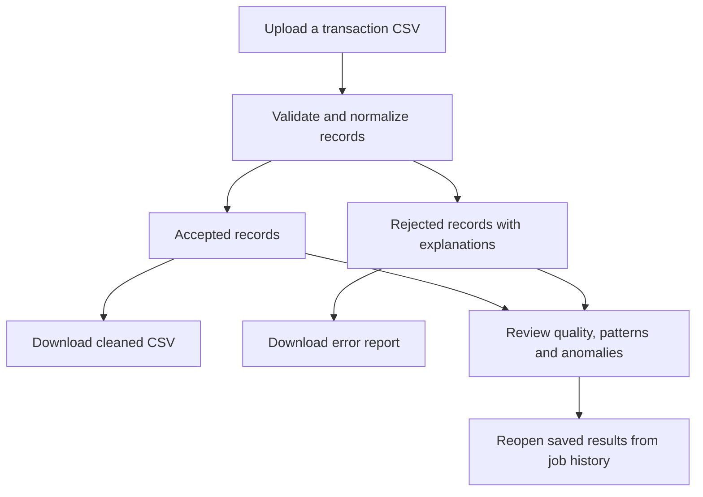
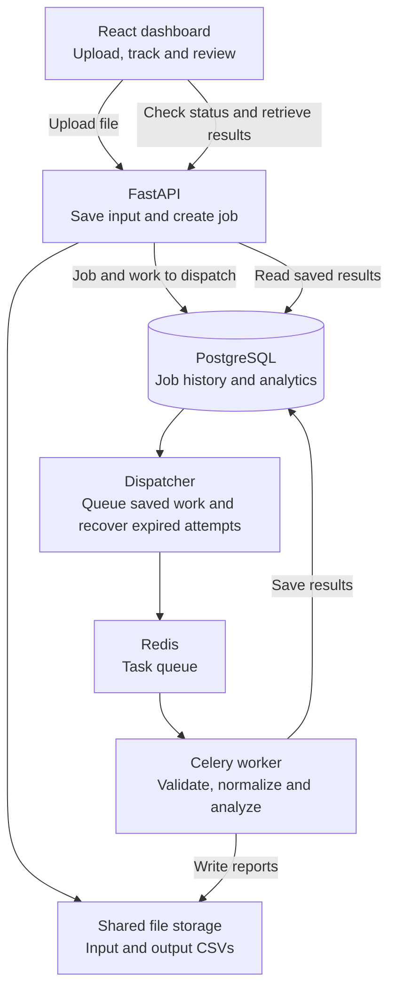

# File Intake & Data Quality Platform

**From transaction CSVs to validated records, clear error reports and measurable data quality.**

A full-stack application that checks customer transaction files, separates accepted and rejected records, and explains the results through an interactive dashboard. Processing runs in the background, with saved job history, downloadable outputs and optional AI summaries.

## What it solves

A CSV can look ready to use while containing invalid dates, inconsistent currencies, duplicate transactions or missing fields. This platform applies a defined set of validation rules and gives each upload a reviewable result: which records passed, which need correction, and which are valid but unusual.

Users can inspect individual errors, compare quality dimensions, download normalized data and return to previous results without uploading the file again. Core processing runs locally without an AI key or hosted service account.

## From upload to results


```mermaid
flowchart TD
    A[Upload a transaction CSV] --> B[Validate and normalize records]
    B --> C[Accepted records]
    B --> D[Rejected records with explanations]
    C --> E[Download cleaned CSV]
    D --> F[Download error report]
    C --> G[Review quality, patterns and anomalies]
    D --> G
    G --> H[Reopen saved results from job history]
```

For example, an invalid email produces a rejected record with an explanation. An otherwise valid order above 1,000 remains accepted but is flagged for review. This separates errors that require correction from unusual values that deserve attention.

| Capability | What the user gets |
|---|---|
| Validation and normalization | Checks across 12 required fields, cross-field rules and duplicate records; consistent formatting in accepted output |
| Quality analysis | A reproducible score, field profiles, recurring error patterns and rule-based anomaly signals |
| Background processing | A job ID immediately after acceptance, visible processing states and automatically displayed results |
| Historical dashboard | Saved analytics, searchable validation errors, file previews and job history with search, filters and pagination |
| CSV exports | Original input, normalized accepted records and rejected records with error details |
| Optional AI interpretation | A saved, downloadable summary based on aggregate measurements, excluding raw customer records |

## System design


```mermaid
flowchart TD
    UI["React dashboard<br/>Upload, track and review"] -->|Upload file| API["FastAPI<br/>Save input and create job"]
    API -->|Job and work to dispatch| DB[("PostgreSQL<br/>Job history and analytics")]
    API --> FILES["Shared file storage<br/>Input and output CSVs"]
    DB --> DISPATCH["Dispatcher<br/>Queue saved work and recover expired attempts"]
    DISPATCH --> REDIS["Redis<br/>Task queue"]
    REDIS --> WORKER["Celery worker<br/>Validate, normalize and analyze"]
    WORKER -->|Write reports| FILES
    WORKER -->|Save results| DB
    UI -->|Check status and retrieve results| API
    API -->|Read saved results| DB
```

FastAPI saves the file and commits the job with its dispatch intent in one database transaction, then returns **HTTP 202**. A separate dispatcher sends the job to Redis, and Celery performs the CSV processing using worker-owned database sessions. PostgreSQL is the primary Compose database; SQLite supports local Python development.

The dashboard follows `pending → queued → processing → completed / failed`, polling while a job is active and loading its analytics when finished. The selected job stays in the URL so a page refresh reopens the same workspace.

### Engineering decisions

| Decision | Why it matters |
|---|---|
| Persist work before publishing to Redis | Accepted jobs remain recorded across API restarts and can be dispatched after a temporary broker outage |
| Claim each execution attempt atomically | Duplicate task deliveries cannot acquire a job already held by an active worker |
| Use attempt-specific files and guarded result commits | An expired worker cannot overwrite the outputs or published results of a newer attempt |
| Bound retries and persist failures | Invalid files and exhausted retries leave an inspectable outcome in job history |
| Validate AI output before saving it | Reports follow a defined schema and remain separate from deterministic quality calculations |

Delivery is at least once, with guarded result publication. Recovery depends on the database, dispatcher, broker, worker and shared storage being available. See the [background processing design](docs/ASYNC_PROCESSING.md) for execution leases, retry policies and failure handling.

## Tech stack

| Layer | Technologies |
|---|---|
| Frontend | React, TypeScript, Vite, Tailwind CSS, Papa Parse |
| Backend | Python, FastAPI, Pydantic, Uvicorn |
| Background jobs | Celery, Redis |
| Database | PostgreSQL, SQLite, SQLModel, SQLAlchemy, Alembic |
| AI integration | OpenAI Python SDK with an OpenAI-compatible provider |
| Testing | pytest, Vitest, React Testing Library, Playwright |
| Infrastructure | Docker Compose, GitHub Actions |

## Run locally

Requires Docker with Compose, Node.js 22+ and pnpm 10.32.1. On Windows, enable Docker Desktop integration for your WSL distro.

```bash
# From the repository root
cp -n .env.example .env
docker compose up --build -d --wait

cd frontend
pnpm install --frozen-lockfile
pnpm dev
```

| Service | Address |
|---|---|
| Dashboard | http://localhost:5173 |
| API | http://127.0.0.1:8000 |
| API documentation | http://127.0.0.1:8000/docs |

Compose starts PostgreSQL, Redis, the API, a Celery worker and the dispatcher. Migrations run at API startup. Database and broker data use persistent volumes; input and output files are stored in `backend/data`.

The root `.env.example` uses `redis://redis:6379/0` for the Compose broker. If an existing root `.env` uses `localhost`, update that value before starting the stack. The backend environment example uses localhost for Python processes running outside Docker.

```bash
# Run from the repository root
docker compose logs -f api worker dispatcher
docker compose down
```

`docker compose down` preserves the database and Redis volumes. The default setup binds the API and Redis to localhost and is intended for a single operator.

For SQLite development, migrations and all environment variables, see the [development reference](docs/DEVELOPMENT.md).

## Try a dataset

Sample files are in `backend/samples/`:

| File | Purpose |
|---|---|
| `normal_demo.csv` | Mostly valid transaction records |
| `heavier_error_demo.csv` | Validation errors and rejected records |
| `anomaly_demo.csv` | Accepted records with anomaly signals |

Upload a sample, explore the Overview, Validation, Data profile and Anomalies views, then download the clean or error CSV. Reopen the job from history to see its saved results. Samples use fictional identifiers and example.com email addresses.

## Validation and scoring

The input schema requires 12 columns covering customer ID, email, country, signup date, order amount, currency, payment method, order status, product category, quantity, discount and last login date. Validation checks field formats, supported values, date consistency, country/currency rules and duplicate records.

Accepted records are normalized; rejected records retain their supplied values and include error explanations. A completed job can contain rejected records. Invalid file structure produces a failed job.

The backend calculates and stores the quality score:

| Dimension | What it measures | Weight |
|---|---|---:|
| Validity | Records that pass validation | 60% |
| Completeness | Required cells containing a value | 20% |
| Uniqueness | Records remaining after duplicate detection | 10% |
| Anomaly health | Accepted records without anomaly signals | 10% |

The score is deterministic and independent of AI interpretation. Anomaly signals use explicit thresholds for order amount, quantity and discount. Amounts remain in their original currencies; aggregate statistics do not perform currency conversion.

See [CSV rules and score calculations](docs/DEVELOPMENT.md) for exact headers, thresholds and handling of empty datasets.

## Optional AI interpretation

AI reports are requested explicitly for completed jobs. The provider receives counts, error-category totals, quality dimensions and numeric profiles. Raw rows, email addresses, customer IDs and filenames are excluded.

Responses must pass a strict Pydantic schema before being saved. Reports can be reopened and exported as Markdown. Configure `OPENAI_API_KEY`, `OPENAI_BASE_URL` and `OPENAI_MODEL` to use a provider; validation and analytics work without them.

## API

| Method | Endpoint | Purpose |
|---|---|---|
| GET | `/health` | Process health |
| POST | `/api/v1/uploads` | Accept a CSV and return its job ID |
| GET | `/api/v1/jobs` | Paginated history with search and status filters |
| GET | `/api/v1/jobs/{id}` | Job status, analytics and saved AI report |
| GET | `/api/v1/jobs/{id}/download/{kind}` | Download `input`, `clean` or `errors` CSV |
| POST | `/api/v1/jobs/{id}/ai-analysis` | Generate or retrieve an AI report |

Interactive request and response schemas are available at `/docs`. Uploads are limited to 10 MiB by default through `MAX_UPLOAD_BYTES`.

## Tests

Backend tests require a Python virtual environment with `backend/requirements.txt` installed. Browser tests also require Docker, Playwright Chromium and free ports 8011 and 5174.

```bash
# From the repository root
backend/.venv/bin/python -m pytest backend/tests -q
pnpm --dir frontend test
pnpm --dir frontend build

cd frontend
pnpm exec playwright install chromium
pnpm test:e2e
cd ..

# Disposable PostgreSQL, Redis and Celery integration checks
backend/.venv/bin/python scripts/verify_async_stack.py
```

Tests cover validation, persistence, migrations, retries, duplicate delivery, polling and browser workflows. Test databases and files are isolated from development data. AI calls are mocked or disabled.

GitHub Actions is configured for backend and frontend tests, the production build and the disposable async integration checks. Detailed execution records are kept in the [verification log](docs/UPGRADE_CHECKPOINT.md).

---

Built by Ayush Satish Mahajan.
