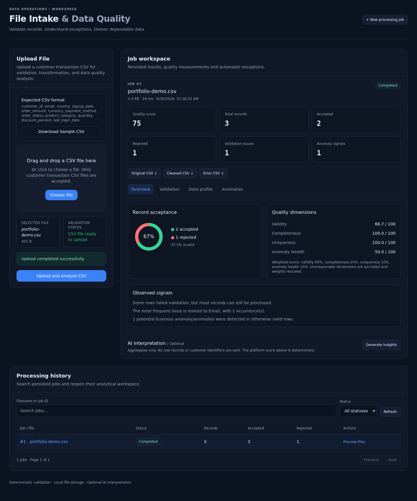
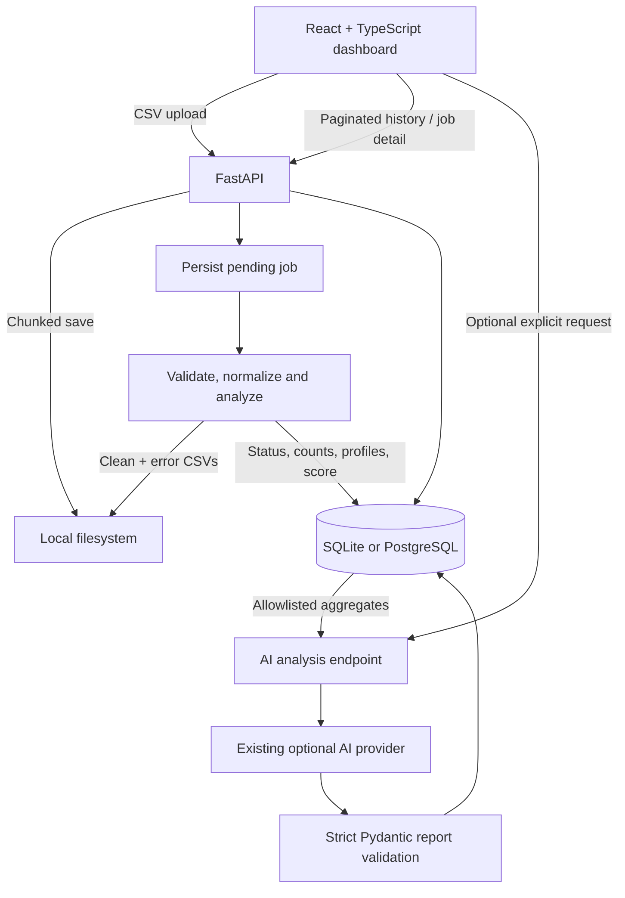

# File Intake & Data Quality Platform

A full-stack operations dashboard for customer transaction CSVs. Upload a dataset, separate accepted and rejected records, inspect reproducible quality measurements, and reopen the same analytical workspace from job history.

Built with React, TypeScript, FastAPI and SQLModel. Run locally with SQLite, or use the included PostgreSQL Docker Compose stack. Optional AI interpretation uses an existing OpenAI-compatible provider; core processing requires no credentials or external account.

## What is implemented

- Size-limited uploads saved in chunks under sanitized UUID-prefixed names.
- Centralized schema, field and cross-field validation; normalized accepted records and row-level error CSVs.
- Persisted `pending → processing → completed / failed` states, including header and decoding failures.
- Deterministic quality score, numeric profiles, top categorical values, repeated error patterns, and heuristic anomalies.
- Historical job workspaces with metrics, accessible charts, validation search, profiling and anomaly tables.
- Server-side job pagination, filename/ID search and status filtering.
- Original/clean/error downloads and multiline-safe CSV previews.
- Optional, explicitly requested AI interpretation using aggregate measurements only, strict response validation and persisted successful reports.
- Alembic migrations that preserve existing SQLite job history; PostgreSQL support through Compose.
- Isolated pytest, Vitest/React Testing Library, and Playwright tests.

**Scope:** This is a single-operator portfolio/internal-tool application, not an authenticated multi-tenant service. Processing currently runs inside the upload request. It has no Celery worker, Redis queue or fabricated percentage progress.

## Screenshots



Captured from the verified Playwright upload workflow. Earlier screenshots remain in `assets/screenshots/` for reference.

## Architecture


```mermaid
flowchart TD
    UI[React + TypeScript dashboard] -->|CSV upload| API[FastAPI]
    API -->|Chunked save| FS[Local filesystem]
    API --> JOB[Persist pending job]
    JOB --> PROCESS[Validate, normalize and analyze]
    PROCESS -->|Clean + error CSVs| FS
    PROCESS -->|Status, counts, profiles, score| DB[(SQLite or PostgreSQL)]
    UI -->|Paginated history / job detail| API
    API --> DB
    UI -->|Optional explicit request| AI[AI analysis endpoint]
    DB -->|Allowlisted aggregates| AI
    AI --> PROVIDER[Existing optional AI provider]
    PROVIDER --> SCHEMA[Strict Pydantic report validation]
    SCHEMA --> DB
```

Backend boundaries:

- `app/api/routes/`: HTTP input, responses, job history and downloads.
- `app/services/`: validation, normalization, orchestration, analytics, scoring and AI integration.
- `app/models/`: job metadata and a separate JSON analytics table.
- `app/schemas/`: typed API and AI response contracts.
- `app/core/`: configuration, database/migrations and JSON logging.
- `app/utils/file_io.py`: chunked upload storage and size limits.

Frontend boundaries:

- `components/layout/AppShell.tsx`: dashboard coordination and selected job.
- `components/panels/`: upload, history, file previews and job workspace.
- `components/analytics/AnalysisView.tsx`: overview, validation, profile and anomaly sections.
- `types/jobs.ts`: shared frontend contracts.
- `lib/api.ts`: API configuration and errors; `lib/csv.ts`: Papa Parse previews.

## Processing semantics

1. Reject missing filenames, non-CSV extensions and oversized uploads before creating a job.
2. Save the original file in 64 KiB chunks; delete partial files if upload saving fails.
3. Persist the job as `pending`, then `processing`, before invoking CSV processing.
4. Decode UTF-8 (including BOM), validate headers, then validate and normalize records.
5. Write clean and rejected-record reports using the upload UUID for collision-resistant names.
6. Persist row counts, analytics, deterministic score, duration and file size.
7. Return the job ID and summary. Content/processing failures return a persisted `failed` job; a completed job can still contain rejected records.
8. The UI loads its persistent detail endpoint. Optional AI interpretation runs as a separate user-requested action.

`POST /uploads` remains synchronous: a successful HTTP response means the request was handled; inspect `status` to determine whether processing completed or failed. Pending/processing states are real persisted states, not a durable background queue. A process crash can leave a job in a nonterminal state; automatic recovery is not yet implemented.

## CSV schema and validation

All headers below are required and case-sensitive. Duplicate headers are rejected. Extra named columns are accepted but not preserved in outputs. Rows with a different field count are rejected. A header-only or empty file is a failed job.

| Field | Rule |
|---|---|
| `customer_id` | Nonempty; repeated customer IDs are allowed across transactions |
| `email` | Nonempty, maximum 254 characters; basic structural check excluding whitespace and repeated `@` |
| `country` | DE, FR, IN, US or GB |
| `signup_date` | Calendar date parsed with `%Y-%m-%d` |
| `order_amount` | Finite, non-negative decimal representable in numeric profiles |
| `currency` | EUR, USD or INR |
| `payment_method` | card, paypal or bank_transfer |
| `order_status` | completed, pending or cancelled |
| `product_category` | Nonempty; free text |
| `quantity` | Positive integer |
| `discount_percent` | Finite decimal from 0 through 100 |
| `last_login_date` | Calendar date, on or after signup |

Cross-field rules:

- German and French records require EUR. Other allowed countries can use any supported currency; this is not a universal currency-conversion policy.
- Completed orders require a nonzero amount.
- Later records with identical required values after trimming/case folding are rejected as duplicate records. Customer ID alone is not a transaction identity.

Normalization uppercases IDs/countries/currencies, lowercases email/payment/status, trims categories, formats dates, and writes amount/discount to two decimal places. Rejected rows retain their supplied field values and list every detected error. `row_number` counts logical CSV records including the header, so the first data record is 2; multiline quoted fields are one record.

Email validation is a structural check, not a deliverability check. No external lookup is performed.

## Deterministic quality score

The platform score is calculated by backend code and persisted. AI scores do not replace it.

| Dimension | Measurement | Weight |
|---|---|---:|
| Validity | Accepted records / all records × 100 | 60% |
| Completeness | Nonempty required cells / all required cells × 100 | 20% |
| Uniqueness | (All records − later duplicate records) / all records × 100 | 10% |
| Anomaly health | Accepted records without heuristic anomalies / accepted records × 100 | 10% |

Dimension values are rounded to two decimals; the weighted overall score is rounded to one decimal. If there are no accepted records, anomaly health is unavailable and remaining weights are normalized to sum to one. Empty datasets have no score. Failed jobs do not display a quality score. Completeness and uniqueness are measured over all parsed data records; profiles and anomaly health describe accepted records only.

These dimensions overlap deliberately: validity is the dominant gate, while the remaining dimensions explain additional aspects of quality. The weights are a documented product choice, not a statistical quality guarantee.

## Analytics and visualizations

- Acceptance donut with the same counts and percentages available as text.
- Error-category bars; one rejected row can produce several issues.
- Numeric count/min/max/average for amount, quantity and discount.
- Top three values for country, currency, payment method, status and category.
- Repeated error combinations and searchable preview of the first 100 rejected records.
- Anomalies: amount above 1,000 in its original currency, quantity above 20, discount above 50%. These review signals do not reject records.
- First 100 anomaly signals retained for display; total anomaly count remains available.

Order amounts are **not converted between currencies**. Aggregate amount statistics and thresholds are descriptive source-unit measurements, not comparable financial totals. Anomaly record numbers refer to the original logical CSV records.

## AI interpretation and privacy

AI is opt-in per job. Missing credentials or provider errors leave deterministic results usable.

The outbound summary contains only counts, status, fixed error-category counts, quality dimensions and numeric profiles. No raw rows, filenames, email addresses, customer IDs, category free text or error snippets are sent. Reports must satisfy a strict Pydantic schema: score range, severity enum, required strings, bounded lists and no extra fields. Invalid reports are not persisted. Successful reports are cached in the database and exportable as Markdown.

Provider and model availability depend on your existing configuration. No live provider calls are made by automated tests.

## Local development — SQLite

Requirements: Python 3.10+, Node 22+ and pnpm 10.32.1.

```bash
# Repository root
cd backend
python3 -m venv .venv
source .venv/bin/activate
pip install -r requirements.txt
cp .env.example .env
uvicorn app.main:app --reload
```

Startup applies Alembic migrations. Default SQLite stays at `backend/file_processing.db`, preserving existing job history. Uploaded/generated files stay in `backend/data/`.

In another terminal:

```bash
# Repository root
npm install -g pnpm@10.32.1
cd frontend
pnpm install --frozen-lockfile
cp .env.example .env
pnpm dev
```

Dashboard: http://localhost:5173 · API: http://127.0.0.1:8000 · OpenAPI: http://127.0.0.1:8000/docs

## Docker — PostgreSQL

```bash
# Repository root
cp .env.example .env
docker compose up --build -d --wait

# Frontend remains a normal local development process
cd frontend
pnpm install --frozen-lockfile
pnpm dev
```

Compose runs PostgreSQL 16 with a named data volume and FastAPI with a mounted file directory. PostgreSQL is internal to the Compose network; the API binds to localhost:8000. Health checks gate startup. Local sample credentials require no external account.

```bash
docker compose logs -f api
docker compose down
```

`down` preserves the database volume. SQLite and Compose PostgreSQL are separate databases: switching modes does not transfer history automatically. Existing SQLite data is not deleted. CSV storage and database backups must be kept together.

## Migrations

```bash
cd backend
source .venv/bin/activate
alembic upgrade head
alembic current
```

The initial migration adopts an existing `processing_jobs` table without rewriting records and creates the analytics table and indexes. Older jobs without analytics remain downloadable and display an explicit historical-data notice. Destructive downgrade is disabled; restore a reviewed backup instead. The default single API process performs startup migrations; larger deployments should run migrations once before starting replicas.

## Configuration

| Variable | Default / purpose |
|---|---|
| `DATABASE_URL` | SQLite at `backend/file_processing.db`; supports `postgresql+psycopg://...` |
| `DATA_DIR` | `backend/data`, with input/output subdirectories |
| `MAX_UPLOAD_BYTES` | 10485760 (10 MiB), configurable file-content limit |
| `CORS_ORIGINS` | Comma-separated explicit browser origins |
| `VITE_API_BASE_URL` | Frontend API address, default `http://localhost:8000` |
| `OPENAI_API_KEY` | Empty; optional existing provider credential |
| `OPENAI_BASE_URL` | Existing repository default `https://models.inference.ai.azure.com` |
| `OPENAI_MODEL` | Existing repository default `gpt-5-mini` |
| `POSTGRES_PASSWORD` | Compose local database credential |

The API does not expose absolute filesystem paths. `.env` files are ignored; `.env.example` files contain no secrets. The Docker build excludes local credentials, databases, virtual environments and runtime data.

## API overview

| Method | Path | Behavior |
|---|---|---|
| GET | `/health` | Process liveness |
| POST | `/api/v1/uploads` | Multipart `file`; synchronous processing and job outcome |
| GET | `/api/v1/jobs?page=1&page_size=10&search=demo&status=completed` | Newest-first paginated jobs, total/page/page_size metadata |
| GET | `/api/v1/jobs/{id}` | Historical counts, analysis, score, duration, size and AI report |
| GET | `/api/v1/jobs/{id}/download/input` | Original CSV |
| GET | `/api/v1/jobs/{id}/download/clean` | Accepted/normalized CSV |
| GET | `/api/v1/jobs/{id}/download/errors` | Rejected records and explanations |
| POST | `/api/v1/jobs/{id}/ai-analysis` | Generate or retrieve validated, persisted AI report |

Page sizes are limited to 100. Invalid query values return 422, missing jobs/files return 404, oversized uploads return 413, and AI requests for noncompleted jobs return 409. AI configuration/provider/schema failures return a typed response with `report: null` and a user-readable error.

## Tests and verification

```bash
# Repository root: safely isolated database AND generated files
backend/.venv/bin/python -m pytest backend/tests -q

cd frontend
pnpm test
pnpm build
pnpm exec playwright install chromium
pnpm test:e2e
```

Backend tests set a temporary database and data directory before importing application modules; they never reset the development database. Tests cover failure persistence, limits, sanitization, analytics, duplicate detection, pagination, AI privacy/schema/cache behavior and legacy migration preservation.

Vitest tests CSV edge cases and meaningful workspace states. Playwright starts temporary SQLite/API and Vite processes on 8011/5174, exercises upload → analytics → refresh/history → preview → failed upload, and checks mobile overflow. It requires the backend virtual environment above. Ports must be free; tests refuse to reuse existing servers. Test data is deleted afterward.

CI runs backend tests, frontend tests and the TypeScript/production build without secrets. Browser and Docker integration checks can be run locally; they are not currently mandatory CI jobs.

## Demonstration workflow

1. Upload `backend/samples/normal_demo.csv` for mostly valid data.
2. Upload `backend/samples/heavier_error_demo.csv` to inspect validation categories.
3. Upload `backend/samples/anomaly_demo.csv` for accepted records with review signals.
4. Switch among Overview, Validation, Data profile and Anomalies.
5. Download the clean/error CSVs and preview their contents.
6. Refresh the page and reopen the job from history; analytics remain available.
7. Optionally generate AI interpretation using existing configured credentials.

All samples use fictional identifiers and example.com email addresses.

## Trade-offs and remaining work

- **Bounded synchronous processing:** uploads are chunked, but validation currently accumulates row collections and duplicate fingerprints in memory. The 10 MiB default limits input size, not total Python memory. True incremental aggregation and a durable queue remain future work.
- **No Redis/Celery yet:** persisted states and frontend polling are ready for a worker, but broker publication, crash recovery, retries and idempotency need a dedicated implementation and failure tests.
- **Filesystem storage:** appropriate for one local deployment; no object-storage accounts required. No retention/deletion workflow yet.
- **Server-state handling:** shared API utilities and abortable React effects are sufficient for current views; no extra global state/query framework is required.
- **Small charts:** accessible SVG/CSS and text tables keep the bundle small. No visualization framework added for simple fixed charts.
- **Preview limits:** the UI fetches the full size-limited CSV, then parses 25 logical records. A ranged/server preview is a future large-file improvement.
- **Single-operator scope:** authentication, per-user authorization and rate limiting are not implemented. Do not expose real customer data through an unrestricted public deployment.

## Interview discussion points

- Why malformed files and invalid records have different outcomes.
- How additive migrations preserve legacy history while new analytics remain optional for older jobs.
- Why customer IDs are not transaction IDs and how duplicate-record detection is defined.
- How score weights, missing dimensions and population selection affect interpretation.
- Why database/file operations are not one atomic transaction and what a durable worker would need.
- How privacy is enforced by aggregate allowlisting rather than a fragile list of fields to redact.
- How isolated databases and browser workspaces prevent destructive regression tests.

Author: Ayush Satish Mahajan.
